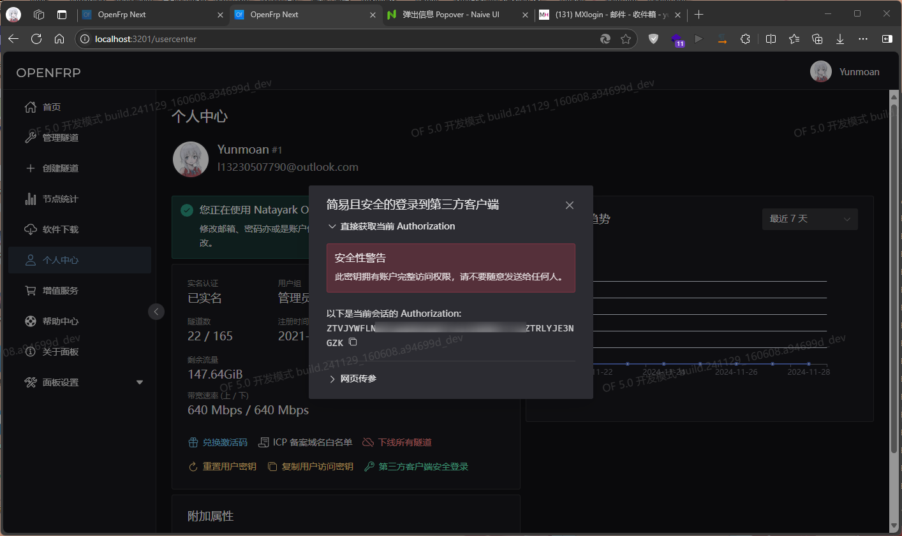

# OpenFrp OPENAPI 使用指南

**欢迎使用 OpenFrp开放映射 API，本指南会帮助您使用我们所提供的API及相关内容。**

>## 阅读前请注意
>
>1. **注意：** OpenFrp OPENAPI 均以`POST`/`GET`方式请求，请求格式为`JSON`。
>
>2. 本文将采用 Postman 工具做请求示例，您可自行前往 Postman 官网下载参照。
>
>3. 除本文所列出的 API 以外，您可自行使用网络抓包工具抓取 OpenFrp 相关的 API 请求，这不会违反用户协议、服务条款等。在传输时，我们采用明文方式传输数据，使用HTTPS保持安全加密。
>
>4. 本文中所显示的大多数密钥、会话ID、用户账户与密码均为虚构，不可用于登录等操作。一般情况下，我们会使用演示账户（test@test.com）来进行操作。本文将尽可能保证获取的量一致。
>
>5. 我们没有义务为您解决您在开发过程中所遇到的错误问题，在使用过程中所遇到的**大多数**问题都可能与我们**无关**！
>
>6. 本文列出的 API *某些地方*可能过时或者有误了，所以欢迎您在使用的同时，帮助我们更新修订本文档。（您可通过提交pr或issue等方式来帮助我们）:-)
>

***

## OpenFrp OPENAPI 使用条款

在您使用 OpenFrp OPENAPI 时，您 **必须** 在项目的 **明显可见位置** 注明使用 OpenFrp OPENAPI ，若要出于美观考虑可尝试降低饱和色，不应恶意隐藏相关内容！若您违反本约定，**我们保留撤销对您使用 OpenFrp OPENAPI 的一切权利**！在使用 OpenFrp OPENAPI 进行商业活动时，必须获得 OpenFrp Project 项目组的**书面协议**授权！

***

传输 JSON 数据时的 ``content-type`` 均使用 ``application/json``，
如登录等API请直接传输 ``body``

**全局键值说明:**

```json
{
    ...
    "flag": true,
    "msg": "Message"
}
```

 \* OpenFrp API 所有API均包含 ``flag``、``msg`` 两个键值，``flag`` 键值用于确定请求是否成功，返回值为 ``true``，``msg`` 键值用于返回API的消息，例如“登录成功”、“OK”等。需要您注意。

***

**目前, OpenFrp API地址为：**
>**<https://of-dev-api.bfsea.xyz>**

**同时，您现在可以使用：**
>**<https://api.openfrp.net>**
>来请求API

您可通过在地址后添加路径来访问API，下文仅向您提供相关API路径以供您参考。

***

## 1. Security Login 安全登录

**注意：这不是一个API接口，而是一种登录方式。有关将此功能通过接口方法实现的方案，我们还在商讨。**

> [!IMPORTANT]
> 优先推荐您使用本方法，因为他不需要保存用户的账号密码等个人信息。
> 相对来说，通过此方法接入 API 更加简单、安全且方便。


在管理面板（241129_170432.5b6949a_rel 之后的构建）-个人中心中，新增 “第三方客户端安全登录” 功能。此功能可直接帮助用户获取当前登录状态下API鉴权的Authorization。

通过将其存储到请求头（Header）中可以直接向服务器请求数据。从而免去复杂的登录 API 接入流程。

启动时要求用户在面板上直接复制，然后粘贴到您的客户端中即可完成登录。



*注意：获取的 Authorization 最长有效期 30 天，请确保其能够被更改。

请求任意接口时，有概率返回新值，请确保其能够自动更新。


## 2. Login 登录API

>API路径：
>/oauth2/callback?code=

>[!WARNING]
>优先推荐您使用 `1. Security Login 安全登录` 所示方法，因为他更加简单且安全。


> [!IMPORTANT]
> 您需要先根据以下步骤请求统一登陆请求接口（Oauth 2.0标准），即 Natayark ID ( 或亦称 Natayark OpenID )后，通过将回调得到的`code`传输给此API，方可获得正确的返回信息。
* 此 API 可帮助您通过账号密码登录到 OpenFrp，除获取节点信息和获取公告外，均需要登录获取会话ID与API认证信息才可用。


### (1) 使用用户账户及密码请求统一登陆请求接口

本 API 需要这些内容：用户账户（用户名或邮箱）、用户密码  

请求类型：``POST``

请求地址：``https://openid.17a.ink/api/public/login``

请求内容：

```json
{
    "user": "test@test.com",
    "password": "test@test.com"
} 
```

>*``user``项支持用户名或邮箱(不区分大小写)，``password``项请使用明文传输(区分大小写)*

在请求正常的情况下，您会得到以下返回值：

```json
{
    "code": 200,
    "msg": "login success, welcome",
    "data": null,
    "flag": true
}
```

### (2) 通过回调地址获取请求API需要的`code`

本 API 需要的前提条件：已请求统一登陆请求接口  

请求类型：``POST``

请求地址：``https://openid.17a.ink/api/oauth2/authorize?response_type=code&redirect_uri=https://of-dev-api.bfsea.xyz/oauth_callback&client_id=openfrp``

请求内容：无  

在请求正常的情况下，您会得到以下返回值：

```json
{
    "code": 200,
    "msg": "query ok",
    "data": {"code": "你看到的code", "state": ""},
    "flag": true
}

```

### (3) 通过传输`code`登录

本 API 需要这些内容：回调OAuth接口得到的`code`

请求类型：``POST``

请求地址：``https://of-dev-api.bfsea.xyz/oauth2/callback?code=``拼接上回调OAuth接口得到的`code`

请求内容：无  

在请求正常的情况下，您会得到以下返回值：

```json
{
    "data": "0ea7223e83d0482cb76eae26b9f7a602",
    "flag": true,
    "msg": "登录成功！"
}
```

> *``data`` 项为本次登录的会话ID(8小时有效期)。  ``flag`` 项为API请求状态，针对所有OpenFrp API均可用，返回值 ``true`` 则请求正常。``msg`` 项为登录后服务器的返回信息，可用于登录确认。*

在收到返回的同时，您需要同时读取返回值 **``Header``** 中的 ``Authorization``内容，并将其保存为变量备用。在文档标注 *``Header``* 的条目需要在请求中的 **``Header``** 附带``Authorization``及其内容。

如您获取到的Header中的``Authorization``为

```text
OPENFRPeyJ0eXAiOiJKV1QiLCJhbGciOiJIUzUxMiJ9.eyJzdWIiOiIwZWE3MjIzZTgzZDA0ODJjYjc2ZWFlMjZiOWY3YTYwMiIsImV4cCI6MTY2NzgwMDUzNH0.jx3VZqUYNhtOYCauHHHb0L9gmQTLBelIsz7hN8zPdJPdpB5paPPYTG1tT7PMVWyGcoOezcyNSKWMpOPZChVuTw
```

请将其添加到您请求操作的Header中，如：
``Authorization:OPENFRPeyJ0eXAiOiJKV1QiLCJhbGciOiJIUzUxMiJ9.eyJzdWIiOiIwZWE3MjIzZTgzZDA0ODJjYjc2ZWFlMjZiOWY3YTYwMiIsImV4cCI6MTY2NzgwMDUzNH0.jx3VZqUYNhtOYCauHHHb0L9gmQTLBelIsz7hN8zPdJPdpB5paPPYTG1tT7PMVWyGcoOezcyNSKWMpOPZChVuTw``

*此内容可能不时更新，需要您注意。请不要使用文档中的内容。*
*每次请求后获得的 Authorization 与 会话ID 均有8小时有效期。*

***

## 2. 获取用户信息API *``Header``*

>API路径：
>/frp/api/getUserInfo

* 此 API 可帮助您获取用户账户的所有信息，非常有用。

本 API 需要用户已登录，程序已获取用户的会话ID和Authorization验证，并将Authorization写入到header中。

### 请求示例

请求类型：``POST``

请求地址：``https://of-dev-api.bfsea.xyz/frp/api/getUserInfo``

请求内容：无，仅需要您POST时附带Authorization即可。  

在请求正常的情况下，您会得到以下返回值：

```json
{
    "data": {
        "outLimit": 1536,
        "used": 0,
        "token": "e900d8f2498202114ec2e9b0597dfb66",
        "realname": false,
        "regTime": "2022-04-06 11:39:01",
        "inLimit": 1536,
        "friendlyGroup": "普通用户",
        "proxies": 4,
        "id": 4,
        "email": "test@test.com",
        "username": "test",
        "group": "normal",
        "traffic": 2171
    },
    "flag": true,
    "msg": "ok"
}
```

> *返回值解释：*
> ``data`` 下的键值
> 键名        | 值内容意
> ----------- | ----------------------------  
> outLimit    | 上行带宽（Kbps）
> used        | 已用隧道（条）
> token       | 用户密钥（32位字符）
> realname    | 是否已进行实名认证（已认证为 ``true`` ，未认证为 ``false`` 。）
> regTime     | 注册时间
> inLimit     | 下行带宽（Kbps）
> friendlyGroup | 用户组名称（文字格式友好名称，可直接输出显示。）
> proxies     | 总共隧道条数（条）
> id          | 用户注册ID
> email       | 用户注册邮箱
> username    | 用户名（用户账户）
> group       | 用户组（系统识别标识）（``normal`` 为普通用户）
>traffic      | ~~红绿灯~~ 剩余流量（Mib）

***

## 3. 获取用户隧道列表 *``Header``*

>API路径：/frp/api/getUserProxies

* 此 API 可帮助您获取用户当前账户下的所有隧道信息（隧道列表）。

本 API 需要用户已登录，程序已获取用户的会话ID和Authorization验证，并将Authorization写入到header中。


### 请求示例

请求类型：``POST``

请求地址：``https://of-dev-api.bfsea.xyz/frp/api/getUserProxies``

请求内容：无，仅需要您POST时附带Authorization即可。  

在请求正常的情况下，您会得到以下类似返回值：

```json
{
    "data": {
        "total": 2,
        "list": [{
            "connectAddress": "homoaddr.com",
            "custom": "homo=true",
            "domain": "[\"homoaddr.com\"]",
            "forceHttps": false,
            "friendlyNode": "日本-1",
            "id": 32933,
            "lastLogin": 1687449600000,
            "lastUpdate": 1687449600100,
            "localIp": "19.19.81.0",
            "localPort": 5173,
            "nid": 6,
            "online": false,
            "proxyName": "homo_web",
            "proxyProtocolVersion": false,
            "proxyType": "https",
            "status": true,
            "uid": 19198,
            "useCompression": true,
            "useEncryption": true
        },
        {
            "autoTls": "false",
            "connectAddress": "cn-cq-plc-1.of-7af93c01.shop:51607",
            "forceHttps": false,
            "friendlyNode": "重庆联通-2",
            "id": 120623,
            "lastUpdate": 1687449600900,
            "localIp": "11.45.1.4",
            "localPort": 11451,
            "nid": 41,
            "online": false,
            "proxyName": "foo",
            "proxyProtocolVersion": false,
            "proxyType": "tcp",
            "remotePort": 1892,
            "status": true,
            "uid": 19198,
            "useCompression": false,
            "useEncryption": false,
            "lastLogin": null
        },
        ...
        ]
    },
    "flag": true,
    "msg": "ok"
}
```

> ***返回值解释：***
> `data` 数组的每一个组都代表着一条隧道，键值均可使用本表参考。 `total` 值为该用户的隧道总数。`list` 既该用户账户下的隧道列表
> 键名        | 值内容意 |
> ----------- | ---------------------------- |
> autoTls | 自动TLS（仅较新的隧道，`"true"` `"false"` `"对应目录下证书名称"`） |
> connectAddress | 由服务端自动生成的连接地址（返回`域名:端口`，IP需自行解析获取） |
> custom | 用户隧道的自定义配置文件（仅设置了的隧道） |
> domain | 此绑定的域名（仅HTTP/S） |
> forceHttps | 此隧道是否强制使用HTTPS（`true`/`false`） |
> friendlyNode | 此隧道所属的节点名称（文本） |
> id | 此隧道ID（数字） |
> nid | 此隧道所属的节点号（数字） |
> uid | 此隧道拥有者的注册ID（数字） |
> proxyName | 此隧道名称（文本） |
> proxyProtocolVersion | 此隧道是否启用 proxy协议（`true`/`false`） |
> proxyType | 此隧道类型（`tcp` `udp` `http` `https` `stcp` `xtcp` 等） |
> remotePort | 此隧道远程端口（仅非HTTP/S隧道，数字） |
> lastUpdate | 此隧道最后一次修改的时间（Unix时间戳） |
> lastLogin | 此隧道最后一次启动的时间（Unix时间戳，从未启动则返回`null`） |
> localIp | 此隧道的本地IP地址 |
> localPort | 此隧道的本地端口 |
> online | 此隧道当前在线状态（请求时刷新状态，状态由服务端返回数据） |
> status | 此隧道是否被启用（`true`/`false`） |
> useEncryption | 此隧道是否启用数据加密（`true`/`false`） |
> useCompression | 此隧道是否启用数据压缩（`true`/`false`） |


***

## 4. 新建隧道 *``Header``*

>API路径：/frp/api/newProxy

* 此 API 可帮助您为用户当前账户新建一条新的隧道。**您需要搭配获取节点列表API使用，因为这样您才可以获取到节点ID**

本 API 需要用户已登录，程序已获取用户的会话ID和Authorization验证，并将Authorization写入到header中。


### 请求示例

请求类型：``POST``

请求地址：``https://of-dev-api.bfsea.xyz/frp/api/newProxy``

请求内容：

```json
{
    "autoTls": "false",
    "custom": "",
    "dataEncrypt": false,
    "dataGzip": false,
    "domain_bind": "",
    "forceHttps": false,
    "local_addr": "127.0.0.1",
    "local_port": "25565",
    "name": "test",
    "node_id": 44,
    "proxyProtocolVersion": false,
    "remote_port": 27388,
    "type": "tcp",
}
```

> *提交值解释：*
> ``data`` 下的键值
> 键名        | 值内容意 |
> ----------- | ---------------------------- |
> autoTls | 自动TLS（字符串，`"true"` `"false"` `"对应目录下证书名称"`） |
> custom | 用户隧道的自定义配置文件（有关自定义配置文件请参考 [OpenFrp用户文档](https://docs.openfrp.net/use) 与 [gofrp官方文档](https://gofrp.org/docs)） |
> dataEncrypt | 是否启用数据加密（``true``/``false``） |
> dataGzip | 是否启用数据压缩（``true``/``false``） |
> domain_bind | 绑定的域名（非HTTP/S隧道可留空不填，仅HTTP/S隧道有效） |
> forceHttps | 是否强制使用HTTPS（``true``/``false``） |
> local_addr | 本地地址(默认可使用 ``127.0.0.1``) |
> local_port | 本地端口 |
> name | 隧道名称(不支持中文) |
> node_id | 节点ID(纯数字，整数型) |
> proxyProtocolVersion | 是否启用 proxy 协议（``true``/``false``） |
> remote_port | 远程端口 |
> type | 隧道类型（包括: ``tcp udp http https stcp xtcp``） |

在请求正常的情况下，您会得到以下返回值：

```json
{
 "data": null,
 "flag": true,
 "msg": "创建成功",
}
```

> *注意：此API返回值的 ``msg`` 项包含多种信息，其包括隧道创建是否成功的信息内容，需要注意。此API的 ``flag`` 项返回为是否创建成功，成功为 ``true``。*
* 建议在新建隧道操作完成后，重新请求获取用户隧道列表。

***

## 5. 删除隧道 *``Header``*

>API路径：/frp/api/removeProxy

* 此 API 可帮助您将用户的选定隧道从账户中删除。**建议您搭配获取用户隧道列表API使用，因为这样您才可以获取到隧道ID**

本 API 需要用户已登录，程序已获取用户的会话ID和Authorization验证，并将Authorization写入到header中。

### 请求示例

请求类型：``POST``

请求地址：``https://of-dev-api.bfsea.xyz/frp/api/removeProxy``

请求内容：

```json
{
    "proxy_id": 11451,
}
```

> *提交值解释：*
> 键名        | 值内容意
> ----------- |----------------------  
> proxy_id        | 隧道ID(纯数字，整数型)

在请求正常的情况下，您会得到以下返回值：

```json
{
 "data": null,
 "flag": true,
 "msg": "操作成功"
}
```

> *注意：此API返回值的 ``msg`` 项包含多种信息，其包括隧道删除操作是否成功的信息内容，需要注意。此API的 ``flag`` 项返回为是否操作成功，成功为 ``true``。*

## 6. **``GET``** 获取节点列表 *``Header``*

>API路径：/frp/api/getNodeList

* 此 API 可帮助您将用户的选定隧道从账户中删除。**建议您搭配获取用户隧道列表API使用，因为这样您才可以获取到隧道ID**

本 API 需要用户已登录，程序已获取用户的会话ID和Authorization验证，并将Authorization写入到header中。

### 请求示例

请求类型：``POST``

请求地址：``https://of-dev-api.bfsea.xyz/frp/api/getNodeList``

请求内容：无，仅需要您POST时附带Authorization即可。  

> *``Authorization`` 值请填写登录时获取的会话Authorization，Authorization有效期不明确，可能需要每4小时获取一次，用于进行API鉴权。*

在请求正常的情况下，您会得到以下返回值：

```json
{
	"data": {
		"total": 39,
		"list": [
			{
				"allowEc": false,
				"bandwidth": 50,
				"bandwidthMagnification": 1,
				"classify": 2,
				"comments": "双程CN2GIA CUVIP CMI",
				"enableDefaultTls": true,
				"group": "vip;svip;admin;dev",
				"hostname": "您无权查询此节点的地址",
				"id": 1,
				"maxOnlineMagnification": 1,
				"name": "香港-1「CN2」",
				"needRealname": true,
				"port": "您无权查询此节点的地址",
				"status": 200,
				"unitcostEc": 1,
				"description": "香港-1「CN2」双程CN2GIA CUVIP CMI",
				"protocolSupport": {
					"tcp": true,
					"udp": true,
					"xtcp": false,
					"stcp": false,
					"http": true,
					"https": true
				},
				"allowPort": null,
				"fullyLoaded": false
			},
			{
				"allowEc": false,
				"bandwidth": 100,
				"bandwidthMagnification": 1,
				"classify": 2,
				"comments": "去程HKBN 回程HKIX|CERA->CMI",
				"enableDefaultTls": true,
				"group": "vip;svip;admin;dev",
				"hostname": "您无权查询此节点的地址",
				"id": 2,
				"maxOnlineMagnification": 0.4,
				"name": "香港-2「BGP」",
				"needRealname": true,
				"port": "您无权查询此节点的地址",
				"status": 200,
				"unitcostEc": 1,
				"description": "香港-2「BGP」去程HKBN 回程HKIX|CERA->CMI",
				"protocolSupport": {
					"tcp": true,
					"udp": true,
					"xtcp": false,
					"stcp": false,
					"http": true,
					"https": true
				},
				"allowPort": null,
				"fullyLoaded": false
			},
            ...
		]
	},
	"flag": true,
	"msg": "OK"
}
```

**因实际节点列表JSON信息过长，本文仅截取前两个节点作演示**

> *返回值解释：*
> ``data`` 数组的每一个组都代表一个节点的信息，键值均可使用本表参考。 ``total`` 值为OpenFrp当前节点总数。``list`` 既所有节点的详细信息
> 键名        | 值内容意
> ----------- | ----------------------------  
> allowEc | 是否允许弹性隧道* （尚未启用）
> bandwidth | 节点的带宽数
> bandwidthMagnification | 节点设计的带宽倍率（换算公式：用户速率*带宽倍率 = 实际获得速率）
> classify | 节点所属区域（``1`` 中国大陆、``2`` 港澳台地区、``3``海外地区 ）
> comments | 节点的标签（如：推荐建站 等）
> enableDefaultTls | 节点是否默认启用TLS
> group | 当前节点所允许使用的用户组（normal即普通用户若用户的用户组不存在于此内容内，创建隧道会被服务器拒绝）
> hostname | 节点所属主机名（节点域名）    或者    “您无权查询此节点的地址”
> id | 节点ID
> maxOnlineMagnification | 在线倍率
> name | 节点名称
> needRealname | 节点运行端口    或者    “您无权查询此节点的地址”
> port | 节点运行端口
> status | 节点状态（可参考[HTTP状态码](https://developer.mozilla.org/zh-CN/docs/Web/HTTP/Status)）（200为正常）
> unitcostEc |   隧道单价
> description | 节点介绍
> protocolSupport | 节点所支持的隧道类型，更新为子元素单独显示(包括 ``tcp udp http https stcp xtcp`` 使用 ``true`` / ``false``作为区分是否准许，此处不再做详细解释)
> allowPort |  允许的端口（为null或者""则为无端口段限制，例如"``(50000,60000)``"则为远程端口限制在50000-60000之间均可使用）
> fullyLoaded | 节点负载状态（ ``true`` / ``false`` ，状态为 ``true`` 时节点满载不可新建隧道）

***

## 7. 编辑隧道 *``Header``*

>API路径：/frp/api/editProxy

* 此 API 可能并不能帮助您为用户当前账户新建一条新的隧道。因为请求需要提供`proxy_id`，即隧道ID。

本 API 需要用户已登录，程序已获取用户的会话ID和Authorization验证，并将Authorization写入到header中。

### 请求示例

请求类型：``POST``

请求地址：``https://of-dev-api.bfsea.xyz/frp/api/editProxy``

请求内容：

```json
{
    "autoTls": "false",
    "custom": "",
    "dataEncrypt": false,
    "dataGzip": false,
    "domain_bind": "",
    "forceHttps": false,
    "local_addr": "127.0.0.1",
    "local_port": "25565",
    "name": "test",
    "node_id": 44,
    "proxyProtocolVersion": false,
    "proxy_id":19198,
    "remote_port": 27388,
    "type": "tcp",
}
```

> *提交值解释：*
> ``data`` 下的键值
> 键名        | 值内容意 |
> ----------- | ---------------------------- |
> autoTls | 自动TLS（字符串，`"true"` `"false"` `"对应目录下证书名称"`） |
> custom | 用户隧道的自定义配置文件（有关自定义配置文件请参考 [OpenFrp用户文档](https://docs.openfrp.net/use) 与 [gofrp官方文档](https://gofrp.org/docs)） |
> dataEncrypt | 是否启用数据加密（``true``/``false``） |
> dataGzip | 是否启用数据压缩（``true``/``false``） |
> domain_bind | 绑定的域名（非HTTP/S隧道可留空不填，仅HTTP/S隧道有效） |
> forceHttps | 是否强制使用HTTPS（``true``/``false``） |
> local_addr | 本地地址(默认可使用 ``127.0.0.1``) |
> local_port | 本地端口 |
> name | 隧道名称(不支持中文) |
> node_id | 节点ID(纯数字，整数型) |
> proxyProtocolVersion | 是否启用 proxy 协议（``true``/``false``） |
> proxy_id | 隧道ID(纯数字，整数型) |
> remote_port | 远程端口(HTTP/S隧道可留空不填) |
> type | 隧道类型（包括: ``tcp udp http https``） |

在请求正常的情况下，您会得到以下返回值：

```json
{
 "data": null,
 "flag": true,
 "msg": "保存成功",
}
```

> *注意：此API返回值的 ``msg`` 项包含多种信息，其包括隧道创建是否成功的信息内容，需要注意。此API的 ``flag`` 项返回为是否创建成功，成功为 ``true``。*

## 8.通过 token 获取隧道列表

>API路径：/api?action=getallproxies&user=<用户密钥,token>

* 此 API 仅可用于获取用户的 全部隧道 列表（JSON），可以以最简单方式使您的应用程式（Applications）接入到 OpenFrp。

* 此 API 仅需 token 鉴权，仅可获取隧道基本信息。由于这个 API 曾经是给 TUI 设计的，故规范有所不同。

>**此 API 已被我们应用于 Frpc 的 Terminal UI，可用于为您参考。相关原理为：**
>
>Frpc 发送请求获取隧道列表 -> 取要启动的隧道的 Proxy_id -> 通过 ez_startup(简易启动)直接启动隧道
>
>*有关简易启动，可参考[用户使用文档](https://openfrp.wiki/use/frpc.html#windows)。*
>
>*即 ``.\<frpc文件名> -u <用户密钥,token> -p <隧道ID>,<隧道ID>(若有多个可使用","分开，最后不要有",")``*


### 请求示例

请求类型：``GET``

请求地址：``https://of-dev-api.bfsea.xyz/api?action=getallproxies&user=e900d8f2498202114ec2e9b0597dfb66``

~~请求内容：~~ 此API为GET请求，无需提交 body。

在请求正常的情况下，您会得到以下返回值：

```json
{
    "status": 200,
    "success": true,
    "message": "上午好！Test",
    "data": [
        {
            "node": "114514 # 演示节点1",
            "proxies": [
                {
                    "name": "example1",
                    "id": 11451,
                    "type": "tcp",
                    "remote": "1.example.com:11451",
                    "local": "127.0.0.1:11451"
                }
            ]
        },
        {
            "node": "114514 # 演示节点2",
            "proxies": [
                {
                    "name": "example2",
                    "id": 56456,
                    "type": "udp",
                    "remote": 2.example.com:11451",
                    "local": "127.0.0.1:1"
                },
                {
                    "name": "example3",
                    "id": 494853,
                    "type": "tcp",
                    "remote": "2.example.com:61438",
                    "local": "127.0.0.1:9797"
                }
            ]
        },
        {
            "node": "114514 # 演示节点3",
            "proxies": [
                {
                    "name": "example4",
                    "id": 45645,
                    "type": "tcp",
                    "remote": "3.example.com:11451",
                    "local": "127.0.0.1:1154"
                }
            ]
        }
    ]
}
```

**因实际隧道列表JSON信息过长，本文仅截取部分作演示，并做修改**

> *返回值解释：*
>  ``status`` HTTP状态码
> ``success`` 请求状态
> ``message``代表登录日志信息
> ``data`` 数组的每一个组都代表一个节点下的隧道，此API通过节点分类，将单个节点下的隧道分类列出。
> 键值均可使用本表参考。``proxies`` 既此节点下的全部隧道列表。
> 键名        | 值内容意
> ----------- | ----------------------------
> node | 节点名称
> proxies | 此**节点名称**下的隧道列表
> name | 隧道名称
> id | 隧道ID ( proxy_id )
> typc | 隧道类型（包括: ``tcp udp http https``）
> remote | 远程地址（域名化） 也就是链接地址（譬如 cn-hk-bgp-4.of-7af93c01.shop:11451）
> local | 本地地址（譬如 127.0.0.1:25565）

***


## 9. 签到 *``Header``*

>API路径：/frp/api/userSign

* 此 API 可帮助用户调用签到API签到获取流量。**注意：您不应该设计任何有关自动签到的相关功能，因为这是违反服务条款的行为，自动签到为滥用行为行为之一。**
* **建议您在签到执行并获得回调后搭配获取用户信息API使用，以探测流量更新。**

本 API 需要用户已登录，程序已获取用户的会话ID和Authorization验证，并将Authorization写入到header中。

> [!IMPORTANT] 
> 由于我们近期为签到功能加入了人机验证，此处内容暂不可供参考。

~~### 请求示例~~

~~请求类型：``POST``~~

~~请求地址：``https://of-dev-api.bfsea.xyz/frp/api/userSign``~~

~~请求内容：~~

~~```json~~
{
}
~~```~~


~~> *提交值解释：*~~
~~> 键名        | 值内容意~~
~~> ----------- |----------------------  ~~

~~在请求正常的情况下，您会得到以下返回值：~~

~~```json~~
{
    "data":"签到成功，获得 4430 Mib + 额外 10 Mib 流量",
    "flag":true,
    "msg":"OK"
}
~~```~~

~~> *注意：此API返回值的 ``data`` 项包含多种信息，其包括签到是否成功的信息内容，需要注意。若用户已经签到，此API的 ``data`` 项返回为 ``"你今天已经签到过啦"`` 。*~~
